# Postgesql backup script

## Pre-requisites

### Postgres server setup

1. A postgres server up and running.
2. A postgres user with appropriate superuser privileges to connect to all databases without any issue.
3. A `.pgpass` file containing the connection strings used to authenticate users without having to specify the password manually. Using a `.pgpass` eliminates the vulnerable method of specifying the password through the command-line (command history and logs).
    ```
    host:port:dbname:username:password
    ```

---
**NOTE**

If a host address is specified in numbers-and-dot notation in the `.pgpass` file then the same format is to be used in while passing the host address through the command line paramater `--host` too. The same applies when dealing with hostnames. 

---

If setting up the postgres server is successful, proceed to create an aws ssm command-document. 

## Create a command-document to run the postgres backup script

Set the `AWS_PROFILE` and `AWS_DEFAULT_REGION` to the appropriate values and ensuring that
the credentials are configured for the profile.


The following script creates or updates "PostgresBackupDocument".

```
#!/bin/bash

# Your SSM document name
DOCUMENT_NAME="PostgresBackup"

# Your script file path
SCRIPT_PATH="./postgres-backup-automation.sh"

# Your SSM document content
DOCUMENT_CONTENT=$(jq -R -n '[inputs]' < "$SCRIPT_PATH")
JSON_CONTENT="{
    \"schemaVersion\":\"2.2\",
    \"description\":\"Create a backup archive of all the databases and uploades the tar archive to an s3 bucket.\",
    \"parameters\":{},
    \"mainSteps\":[
        {
            \"action\":\"aws:runShellScript\",
            \"name\":\"runShellScript\",
            \"inputs\":
            {
                \"runCommand\":$DOCUMENT_CONTENT
            }
        }
    ]
}
"
# Check if the document exists
if aws ssm describe-document --name "$DOCUMENT_NAME" >/dev/null 2>&1; then
    # If the document exists, update it
    echo Document ${DOCUMENT_NAME} already exists, updating it
    VERSION=$(aws ssm update-document --name "$DOCUMENT_NAME" --content "$JSON_CONTENT" --document-format "JSON" --document-version "\$LATEST" --query 'DocumentDescription.LatestVersion' --output text)
else
    # If the document doesn't exist, create it
    echo Creating document ${DOCUMENT_NAME}
    aws ssm create-document --name "$DOCUMENT_NAME" --content "$JSON_CONTENT" --document-format "JSON" --document-type "Command" 
    VERSION="1"
fi

aws ssm update-document-default-version --name "${DOCUMENT_NAME}" --document-version "${VERSION}" 
```

### Brief explanation of the above script

1. Set the `DOCUMENT_NAME` variable to the name of the document that is to be created.
2. Set the `SCRIPT_PATH` variable to `/path/to/postgres-backup-automation.sh` (absolute or relative to this script).
3. Pass the `SCRIPT_PATH` to `jq` for parsing which outputs the `postgres-backup-automation.sh` as a long command. Store the output of the `jq` command to a variable `DOCUMENT_CONTENT`.
4. `JSON_CONTENT` variable contains the the content of the document that is going to be created using this script. The value corresponding to the key `runCommand` is set to `DOCUMENT_CONTENT`.
5. The `if` condition verifies if there is an already existing command-document with the same name `DOCUMENT_NAME`. If it exists then the document's content is updated and the default version number is incremented. If a document with the same name is not present, then a new command-document is created with the given contents whose version number is set to 1.

Save this script as `create-document-postgres-backup.sh` and run it to create an ssm command-document with the given details.

Run the script:
```
chmod +x /path/to/create-document-postgres-backup.sh    # make it an executable 
./create-document-postgres-backup.sh                    # execute it
```

```
Creating document PostgresBackup
{
    "DocumentDescription": {
        "Hash": "8188681eb20adc5f57832ac7e322e2bac595cd7990a57095ee453670191ee8b5",
        "HashType": "Sha256",
        "Name": "PostgresBackup",
        "Owner": "369106762403",
        "CreatedDate": 1688021707.01,
        "Status": "Creating",
        "DocumentVersion": "1",
        "Description": "Create a backup of all the databases and uploade the tar archive to an s3 bucket.",
        "Parameters": [],
        "PlatformTypes": [
            "Linux",
            "MacOS"
        ],
        "DocumentType": "Command",
        "SchemaVersion": "2.2",
        "LatestVersion": "1",
        "DefaultVersion": "1",
        "DocumentFormat": "JSON",
        "Tags": []
    }
}
{
    "Description": {
        "Name": "PostgresBackup",
        "DefaultVersion": "1"
    }
}
``` 

### Contents of `postgres-backup-automation.sh`:
```
#!/usr/bin/env bash

# setting the backup directory variable
if [ -z "${PG_BACKUP_DIR}" ]; then
	PG_BACKUP_DIR="${HOME}/aws-downloads"
fi

# creating the backup directory if it does not exists
if [ ! -d "${PG_BACKUP_DIR}" ]; then
	mkdir "${PG_BACKUP_DIR}"
fi

echo "Exporting data to ${PG_BACKUP_DIR}."

# connection parameters
PGHOST="127.0.0.1"
PGPORT="5432"
PGUSERNAME="postgres"
PGCONNDBNAME="postgres"

# exporting the PGPASSFILE environment variable
# check for file existence manually
# check for file permissions to be 0600
export PGPASSFILE="${HOME}/.pgpass"

if [ ! -f "${PGPASSFILE}" ]; then
	echo "${PGPASSFILE} not found. Exiting." && exit
fi

# specifying the database names to be excluded while creating the backup 
DBS_TO_EXCLUDE="postgres template0 template1"

# generate --exclude-database parameter string
if [ -z "${DBS_TO_EXCLUDE}" ]; then
	EXCLUDE_STRING=""
else
	EXCLUDE_SRTING=$(for db in ${DBS_TO_EXCLUDE} ; do echo -n "--exclude-database=${db} "; done)
fi

TODAY=$(date "+%Y%m%d-%H%M")
BACKUP_FILENAME="PG-BACKUP-COMPLETE-${TODAY}.sql"

# creating the backup
pg_dumpall --host=${PGHOST} --port=${PGPORT} --username=${PGUSERNAME} --database=${PGCONNDBNAME} --no-password --clean ${EXCLUDE_SRTING} --file=${BACKUP_FILENAME} && echo "Exporting to ${BACKUP_FILENAME} successfull";

# compressing the plain-text .sql file to a g-zip tar archive
tar -cvzf "${PG_BACKUP_DIR}/${BACKUP_FILENAME}.tar.gz" "${BACKUP_FILENAME}"

# s3 bucket uri to which the backup file has to be uploaded
BUCKET_URI="s3://qapboard-testing/backup/tars/"

# uploading the backup tar archive to the s3 bucket
aws s3 cp "${PG_BACKUP_DIR}/${BACKUP_FILENAME}.tar.gz" ${BUCKET_URI}

# deleting the .sql file generated
if [ -f "${BACKUP_FILENAME}" ]; then
	rm -f "${BACKUP_FILENAME}"
fi
```

### Explanation of the above script

1. `PG_BACKUP_DIR` contains the location `/path/to/backup/dir` in which the exported tar files are stored.
2. If the `PG_BACKUP_DIR` does not exist, then it is created.
3. Set the connection parameter varaibles.
4. Export the `.pgpass` file to environments variable `PGPASSFILE`.
5. Check if `PGPASSFILE` exists and if its file permissions are set to 0600 or less
6. `DBS_TO_EXCLUDE` contains the names of all databases that have to be excluded by `pg_dumpall` command while creating the backup. Specify the names in a space-separated manner. Leave it empty is everything has to be included.
7. `pg_dumpall` command is executed with the necessary arguments which exports a `.sql` file in plain-text format to `BACKUP_FILENAME` 
8. This `.sql` file is then passed to `tar` to create a **TAR Gzip** archive.
9. `BUCKET_URI` specifies the S3 bucket uri string to which the `.tar.gz` archive is uploaded. This is done with the help of `awscli`.
10. The generated `.sql` file is then deleted after checking its existence for failproof with an `if` condition.

## Steps to create a Maintenance Window for automating the backup task

1. Navigate to `AWS Systems Manager > Maintenance Windows` and click on the `Create maintenance window` button.

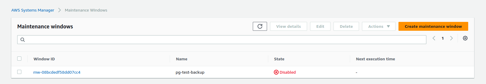

2. Fill in the necessary MW details.

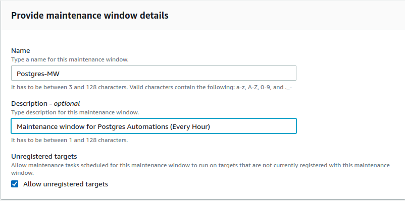

3. Specify the options to schedule the tasks with the help of cron/rate schedulers. It is also possible to use cron/rate expressions to schedule the jobs.

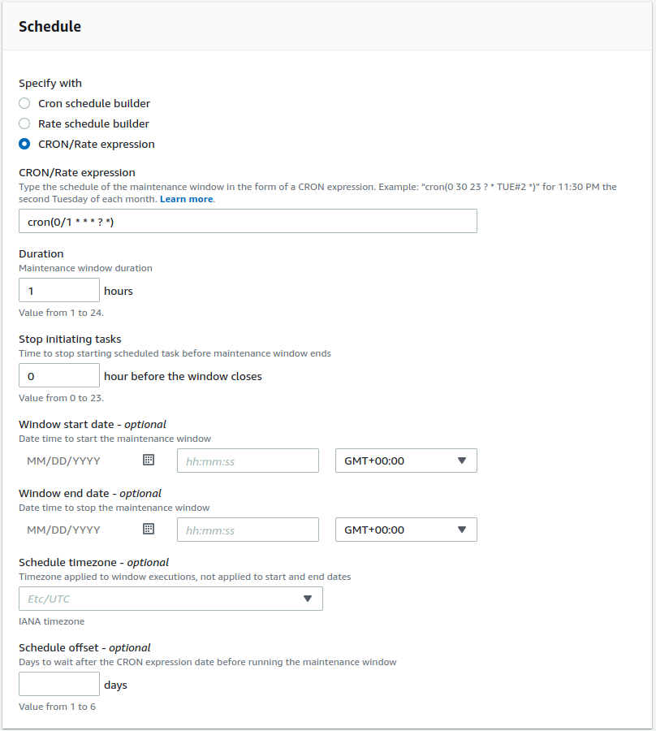

4. After providing all the details click on the "Create maintenance window". You can also attach tags that are to be attached to this MW. 

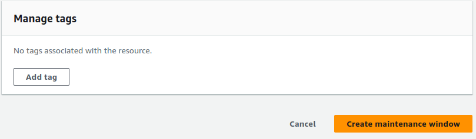

5. If there are no issues with the options specified, a new MW is created.

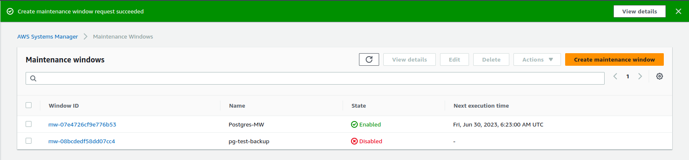

## Steps to add a task in a Maintenance window

1. Click on the Window ID to open up the settings corresponding to that MW and navigate to the **Tasks** tab. Click on **Register Run command task** from the options listed under **Register tasks** drop down. 

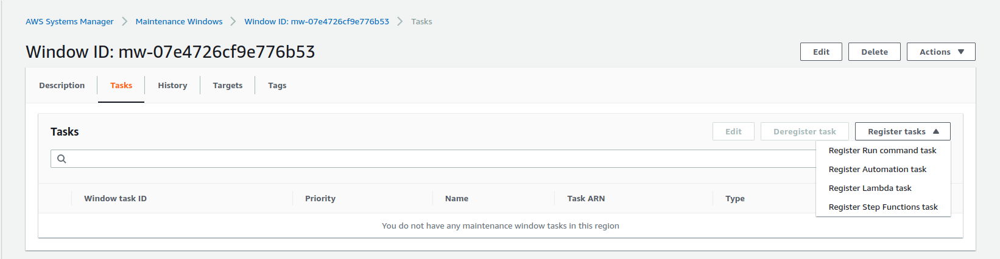

2. Fill in the required task details. 

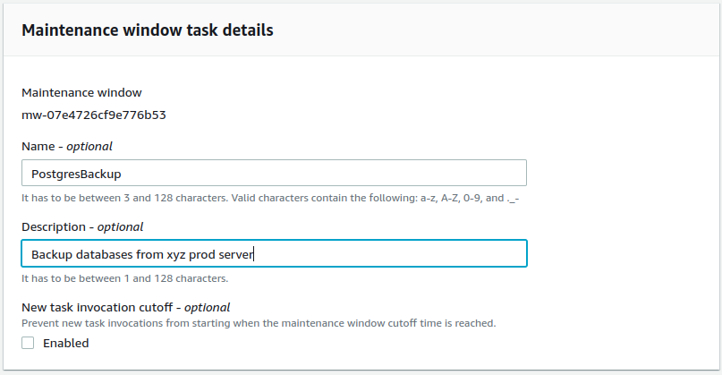

3. Select the command-document from the list. Choose the version number (mostly default). 

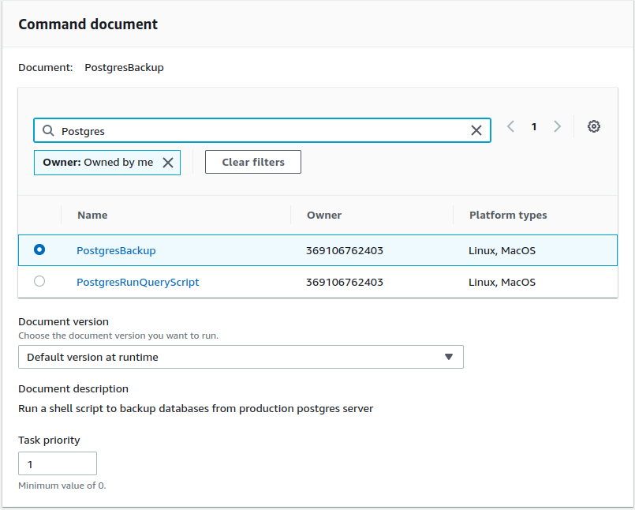

4. Select the targets. It is also possible to register a target to be associated with this MW, and select that registered target in this step. Or choose unregistered targets manually. 

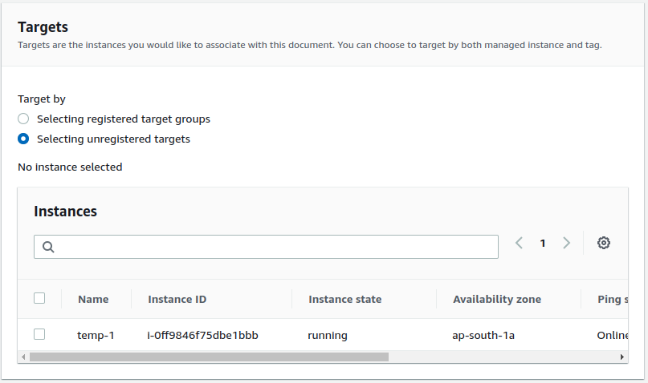

5. Fill the the rate control options. 

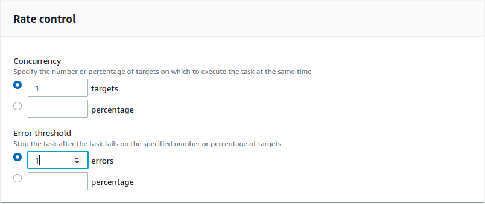

6. Select the correct IAM service role that is to be assumed while executing the task **(this is necessary to assume the correct permissions)**.

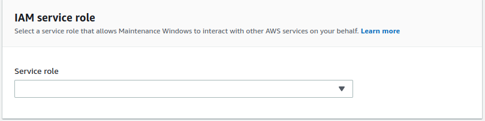

7. Specify the output options to keep track of the logs. **(This is mandatory. every execution has to be logged properly)** .

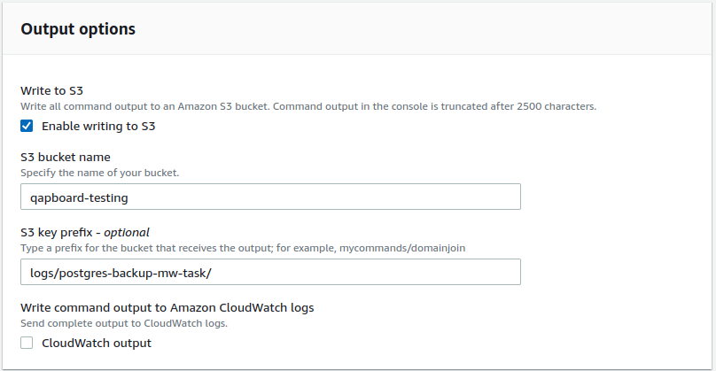

8. Specify a note about the command.

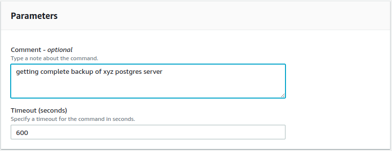

9. Click on the "Register Run command task" button. 

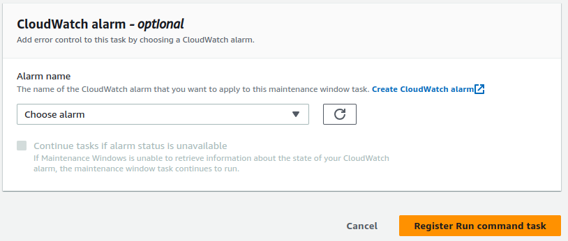

10. A new task gets listed in the **Tasks** tab. 

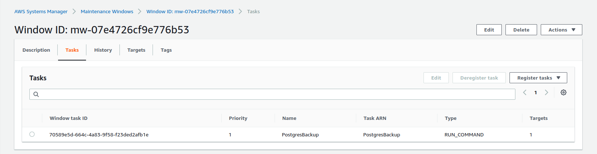

11. View history of each execution in the **History** tab. 

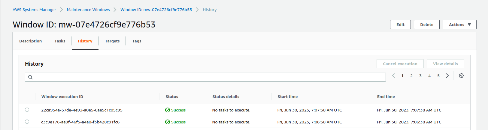

Follow the on-screen information to view logs, edit tasks etc.

---

